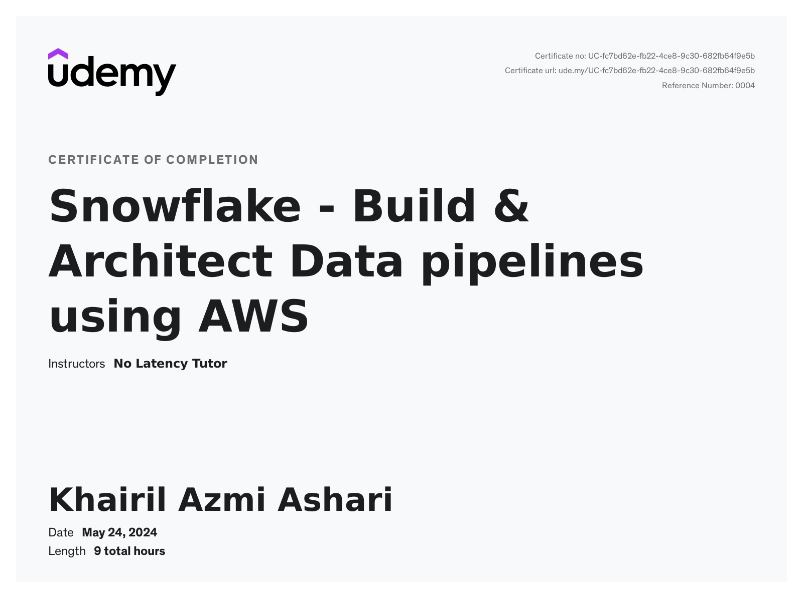

# Snowflake AWS Data Pipeline

In this project will cover:
- AWS Cloud with Snowflake as a data-warehouse
- Snowflake as a data-warehouse & automated pipelines within snowflake ecosystem
- Snowflake with python, Spark and Airflow on AWS
- Real time Streaming with Kafka anda Snowflake
- Using Snowpark for Data Pipelijnes and Data Science

## Certifiacte for Completion
  

